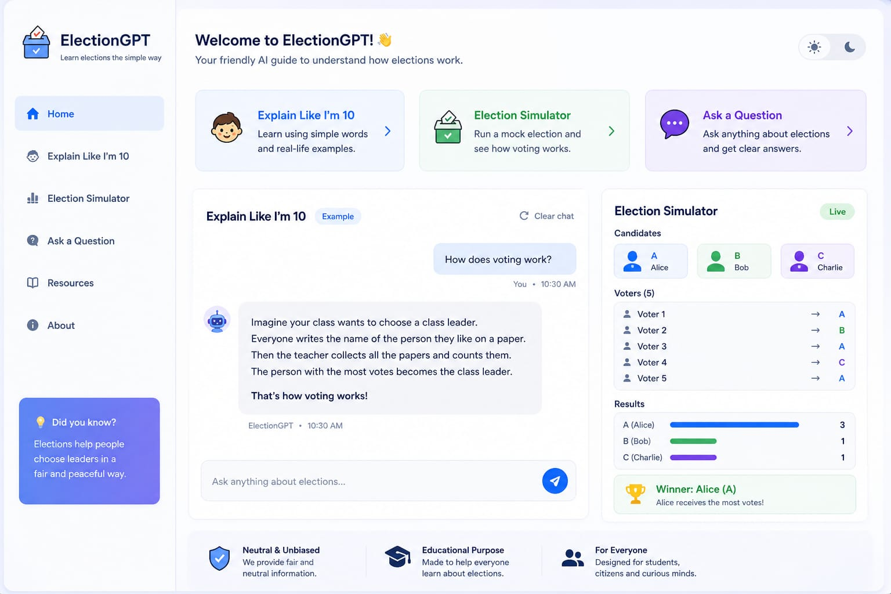

# 🗳️ ElectionGPT  
### *Learning elections the simple, human way*
🗳️ ElectionGPT

Not just explaining elections — making them easy to understand

«🏆 Built for Prompt Engineering Competition
💡 Focus: Human-like AI teaching»

---

🌟 What is this?

ElectionGPT is a simple AI assistant designed to explain elections the way a real teacher would—calm, clear, and easy to follow.

No complicated words.
No textbook style.
Just understanding.

---

✨ Why this stands out

Most AI explains like this:

«“An election is a formal decision-making process…”»

ElectionGPT explains like this:

«“Imagine your class wants to pick a leader…”»

👉 That difference is the whole idea.

---

🧠 Core Idea

If a child can understand something, anyone can.

This project focuses on:

- Simple thinking
- Real-life examples
- Natural conversation

---

🧩 Prompt Design Approach

Instead of giving strict instructions, the prompt:

- Creates a teaching situation
- Uses human tone
- Encourages step-by-step thinking

---

📂 Project Files

- "prompts.txt" → Human-like prompt structure
- "demo.txt" → Real conversation examples
- ".gitignore" → Clean setup

---

🔍 Demo

User: How does voting work?

AI:
Have you ever chosen a class monitor?

Everyone writes the name of the person they like.
Then all the names are counted.

Whoever gets the most votes becomes the leader.

That’s how voting works—just on a bigger scale.

---

🧪 Demo Concept: Election Playground

Imagine a simple tool where:

- 👶 A child can learn using stories
- 🎮 Users can simulate voting
- ❓ Anyone can ask questions freely

This project is the foundation for that idea.

---

🎯 What this project proves

AI is not about sounding smart.
It’s about being understood.

---

⚖️ Ethics

- Neutral and unbiased
- No persuasion
- Only educational explanations

---

🏁 Final Thought

The best explanation is not the most detailed one—
it’s the one people actually understand.# election-ai-assistant
AI assistant for explaining election process, voting steps, and timelines.
